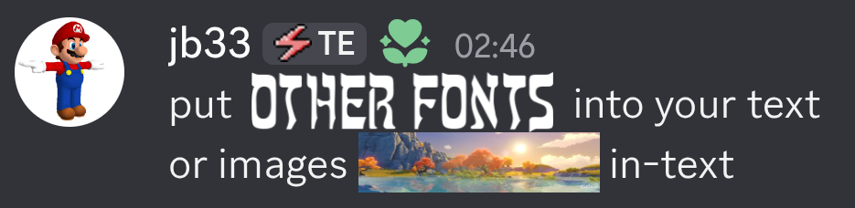
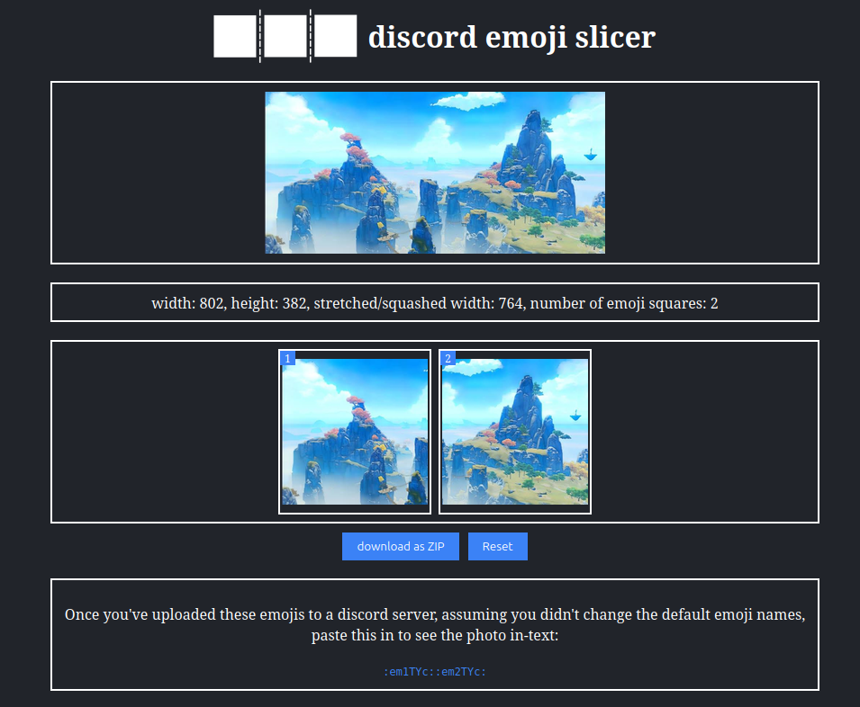
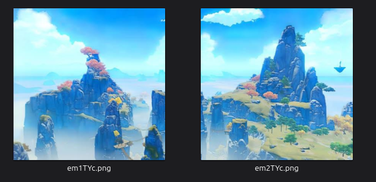
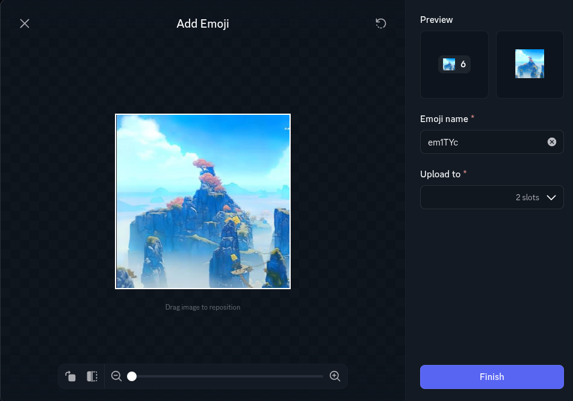

# Discord Emoji Slicer
## Try the tool:
GitHub Pages:
https://neaflow.github.io/discord-emoji-slicer/

My own hosting:
https://emojislicer.neaflow.com/

## What is this for?

Discord lets you use custom emojis in the same server that the emojis were uploaded to (or for Nitro members, anywhere) with **no gap** between them, meaning a wide image can effectively be rendered in-text by slicing one full image into multiple square emojis, uploading it into a server, then sending each emoji with no space next to each other.

This tool's purpose is to take in any (wide) image, and give you an output as a ZIP of each exact square PNG that you'd upload to the Discord server, plus the string you'd then paste into the message box to insert each emoji next to each other without spaces. It's important that you do use the outputted string from this tool, as Discord's built-in emoji selector adds spaces between emojis which is annoying to remove.

How it works:

- Give it a wide image in the upload box

- It stretches or squashes the width of the image as to where the width becomes a multiple of the height, meaning the image can be cut into an exact number of perfect squares

- It then cuts the image into the squares and packages them into a downloadable ZIP

## Example

Here's a message where a custom font alongside a photo was rendered in-text using emojis made with this tool:

## How to use it

### 1. Upload or paste an image

Click **Upload image** or `ctrl + v` with an image on the clipboard on the page to insert the image

### 2. Check the info and the sliced output

It'll show what the width of the original image was adjusted to in order for the output to be able to be cut into perfect squares, alongside a count/preview of each emoji

### 3. Download the ZIP

Click **Download as ZIP**. The site will give you a .zip file containing each emoji (`em1xxx.png`, `em2xxx.png`, etc.; the random letters at the end prevent name conflicts if you've used the tool before in the same server).

### 4. Upload the emojis to your Discord server

Open a Discord server where you have permissions to edit/add emojis, and where there's enough emoji slots. Go to **Server Settings → Emoji**, and add each emoji from the ZIP file. Don't rename them or the string to paste into the message box provided by the tool won't work. Do this for each image.

### 5. Paste the string into Discord

Copy the string provided by the tool and paste it into a message box in that server, or if you are a Nitro member, anywhere to see the image be added in-text gapless.

